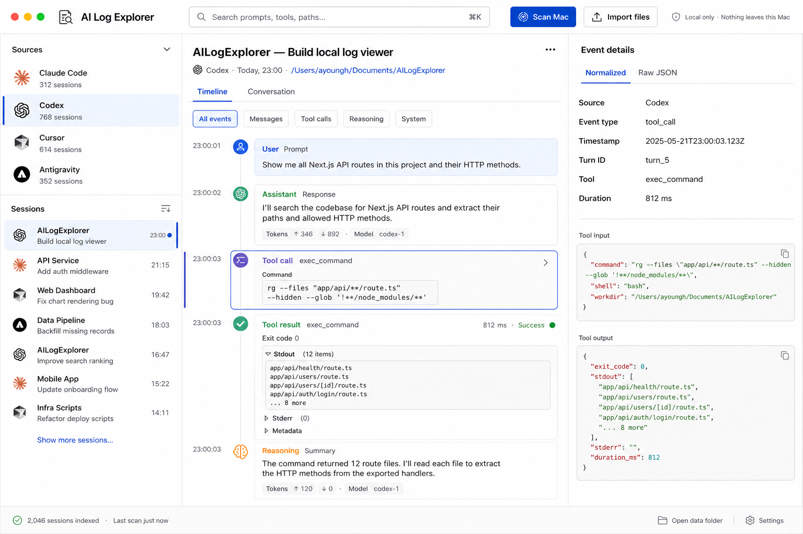
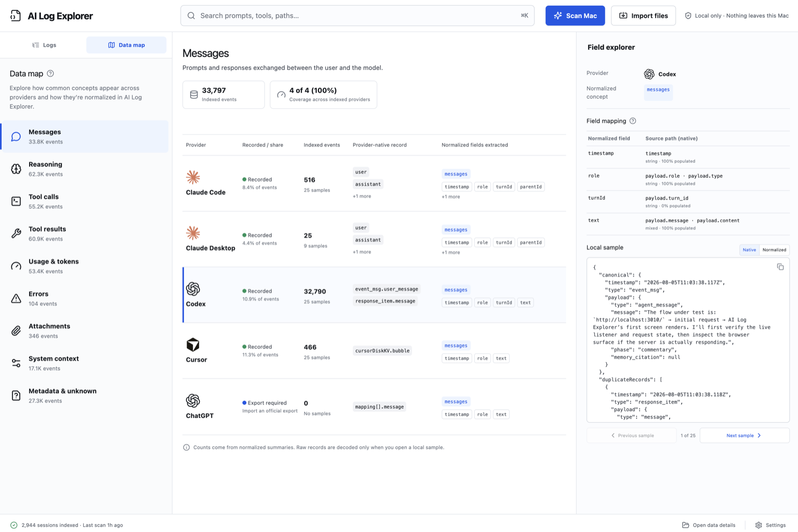

# AI Log Explorer

AI Log Explorer is an open-source, local-only Next.js app for exploring AI
conversation and agent histories without uploading them.

## Preview

### Logs

Browse normalized sessions, timelines, tool activity, and event details.



### Data map

The Data map compares how providers record messages, reasoning, tools, usage,
errors, attachments, system context, and metadata, with normalized field
mappings and sanitized local samples.



It currently understands histories from:

- Claude Code
- Claude Desktop
- Codex
- Cursor
- Official ChatGPT exports
- Official Claude exports

## Privacy model

AI histories can contain highly sensitive material. AI Log Explorer keeps that
material on your Mac:

- The server binds to `127.0.0.1` and rejects non-loopback requests.
- Source histories are opened read-only.
- The generated search index stays in `.data/ailogexplorer.sqlite`.
- `.data`, log exports, databases, private screenshots, and generated files
  are excluded from Git. The two reviewed app screenshots above are the only
  screenshot exceptions.
- There is no telemetry, analytics, cloud storage, remote font, or hosted model
  request.

The local index contains normalized events, searchable text, source paths, and
compressed raw records. Treat it as private. Use **Clear local index** in the
app to remove indexed data, or delete the `.data` directory while the app is
stopped.

### Provider storage and encryption

The ChatGPT Mac app stores conversation cache files beneath
`~/Library/Application Support/com.openai.chat/`, including encrypted
`conversations-v3/*.data` records. AI Log Explorer detects these files so it
can explain why ChatGPT appears as **Export required**, but it never attempts
to extract keys or decrypt their contents.

The detected number is a cache-file count, not a reliable conversation count:
a conversation may span records, and cached records may not correspond
one-to-one with chats.

To explore ChatGPT history, request an official data export from ChatGPT,
extract the archive, and choose **Import files** to import its conversation
JSON. The import is parsed locally and its temporary processing copy is
removed when the job finishes. The downloaded export itself remains sensitive
and is not deleted or modified by AI Log Explorer.

Other supported providers expose different local formats:

- **Codex** stores readable JSONL session histories. Some reasoning events can
  contain an opaque `encrypted_content` field; AI Log Explorer displays any
  available plaintext summary and marks the encrypted portion, but does not
  attempt to decrypt hidden reasoning content.
- **Claude Code** stores readable JSONL histories containing messages,
  reasoning, tool calls, and results.
- **Claude Desktop** local-agent audit histories are also readable JSONL. Their
  audit HMAC fields are integrity metadata, not encrypted conversation
  content.
- **Cursor** stores supported histories in a readable `state.vscdb` SQLite
  database. It is not treated as encrypted, but it remains highly sensitive
  because it can contain prompts, responses, project paths, and tool data.
- **Official ChatGPT and Claude exports** contain readable conversation JSON
  and should be protected like any other private history archive.

AI Log Explorer opens source histories read-only. Its own
`.data/ailogexplorer.sqlite` index is compressed but not encrypted, so local
filesystem access to the index should be treated as access to the underlying
conversation data.

> [!WARNING]
> AI Log Explorer is designed for one trusted user on a local Mac. Do not
> deploy it as a public or remotely accessible web service. Open source code is
> not the same as a safe public deployment.

## Requirements

- macOS
- Node.js 24
- pnpm 10

If you use `nvm`, the repository includes the expected Node version:

```bash
nvm use
```

## Run

```bash
pnpm install
pnpm dev
```

Open [http://127.0.0.1:3000](http://127.0.0.1:3000).

Use **Scan Mac** to index registered local history locations, or **Import
files** for JSON, JSONL, Cursor SQLite databases, and official export JSON. File
imports are copied to a temporary directory for parsing and removed when the
job finishes.

### Try the example logs

The repository includes four small, generated histories in
[`examples/provider-native`](examples/provider-native): one each for Codex,
Claude Code, Claude Desktop, and Cursor. Every project, prompt, path, output,
identifier, model name, and timestamp in these files is fictional.

Choose **Import files** and select all four example files to explore the
timeline, filters, search, and raw-record inspector. Examples are never loaded
automatically. Re-importing the same files updates the existing example
sessions instead of creating duplicates, and **Clear local index** removes them
along with every other indexed session.

For a production build:

```bash
pnpm build
pnpm start
```

The production server also binds to loopback.

## Verification

Run the complete public-release gate:

```bash
pnpm verify
```

Or run checks individually:

```bash
pnpm check:public
pnpm audit --prod
pnpm typecheck
pnpm lint
pnpm test
pnpm build
```

`check:public` examines tracked files and untracked files that are not ignored.
It rejects common AI-log exports, databases, screenshots other than the exact
root `screenshot.png` and `data-map-screenshot.png` showcase assets, personal
home paths, non-example email addresses, and credential formats before they
can be published. The four generated files under `examples/provider-native`
are the only provider-native fixture exceptions and are independently checked
against their canonical synthetic definitions.

## Development

See [CONTRIBUTING.md](CONTRIBUTING.md) for setup, verification, and the
synthetic-data policy. Report vulnerabilities privately as described in
[SECURITY.md](SECURITY.md).

The app includes streaming provider adapters, cancellable persisted jobs,
idempotent rescans, Brotli-compressed raw and large normalized payloads, FTS5
search, diagnostics, pagination, responsive drawers, URL-addressable selection
and filters, and normalized/raw event inspection.

## License

AI Log Explorer is available under the [MIT License](LICENSE).
